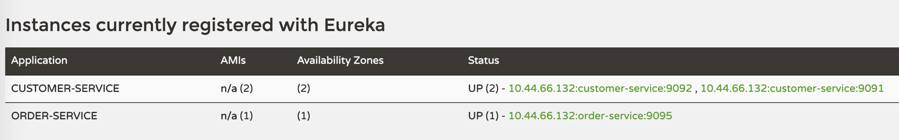
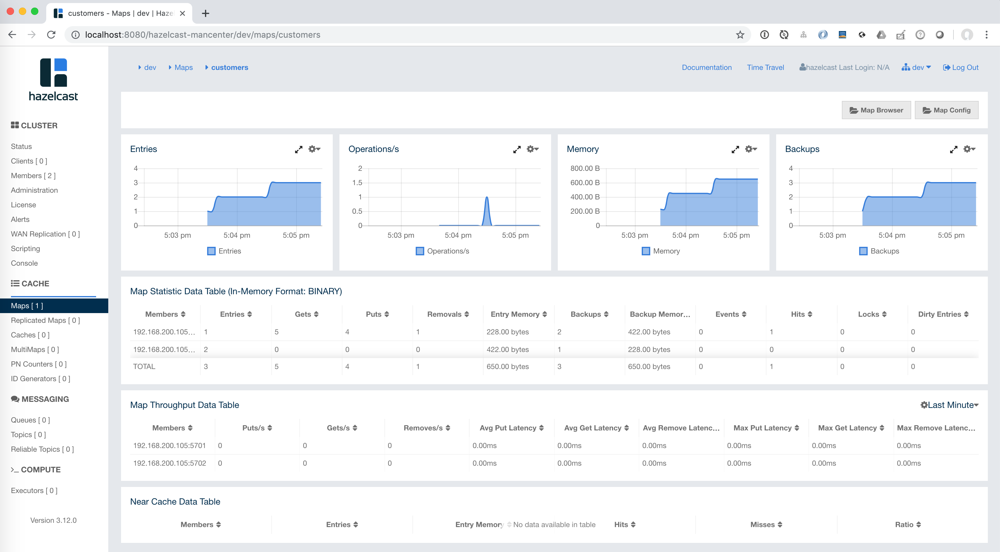

#### Getting started

1. Start Eureka

```bash
$ spring cloud eureka
```

2. Start up 2 instances of `customer-service`

```bash
$ java -jar target/customer-service-0.0.1-SNAPSHOT.jar --server.port=9091
$ java -jar target/customer-service-0.0.1-SNAPSHOT.jar --server.port=9092
```

They will join a `Hazelcast` cluster

```bash
Members {size:2, ver:4} [
	Member [10.44.66.132]:5701 - 7e8e4b73-30fa-4a29-a7bb-95075955f84b
	Member [10.44.66.132]:5702 - c6dca00d-0941-4f20-9f46-f7ab5f7e2c96 this
]
```

3. Start up an instance of `order-service`

```bash
$ java -jar target/order-service-0.0.1-SNAPSHOT.jar
```

This will create its own `Hazelcast` cluster

```bash
Members {size:1, ver:1} [
	Member [10.44.66.132]:5703 - 730f6d78-527d-402f-be99-3c5acddabc7f this
]
```

4. Verify that the services are registered into `Eureka`



5. Test caching

Fetch two customers:

```bash
$ http :9091/customers/1
$ http :9091/customers/2
```

You should see in the logs

```bash
...
Loading customer with id '1' into cache
...
Loading customer with id '2' into cache
...
```

Update the customer with id '1'

```bash
$ echo '{"name":"zoltan"}' | http put :9091/customers/1
```

In the logs:

```bash
...
Removing customer with id '1' from the cache
...
```

Fetching again the customer with id '1' and '2'

```bash
$ http :9091/customers/1
$ http :9091/customers/2
```

In the logs you should see a log statement for customer with id '1' only. 

```bash
...
Loading customer with id '1' into cache
...
```

#### Monitoring

Start up the `management-center` with

```bash
$ java -jar hazelcast-mancenter-3.12.war 8080 hazelcast-mancenter
```

This will create a folder `<user-home>/hazelcast-mc`

Set a username and password: hazelcast/s3cr3t!!

You can use the use the [Management Center](https://hazelcast.org/download/#management-center) provided by Hazelcast



However is only free to use for clusters of 2 members only.

Resources:

1. https://hazelcast.com/blog/hazelcast-auto-discovery-with-eureka/
2. https://codeboje.de/caching-spring-boot/
3. https://medium.com/@igorkosandyak/spring-boot-with-hazelcast-b04d13927745
4. https://stackoverflow.com/questions/51344193/speeding-up-netflix-eureka-unregistration-not-working-for-spring-boot